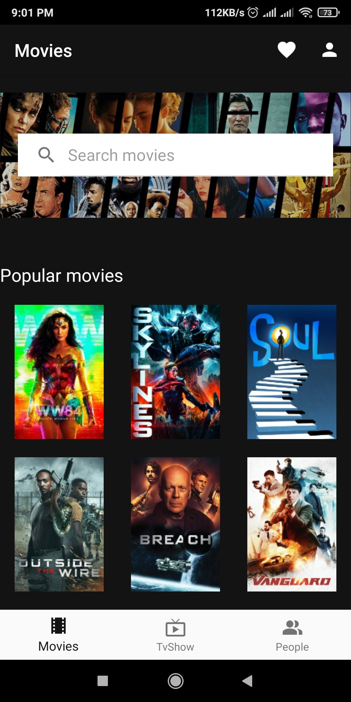
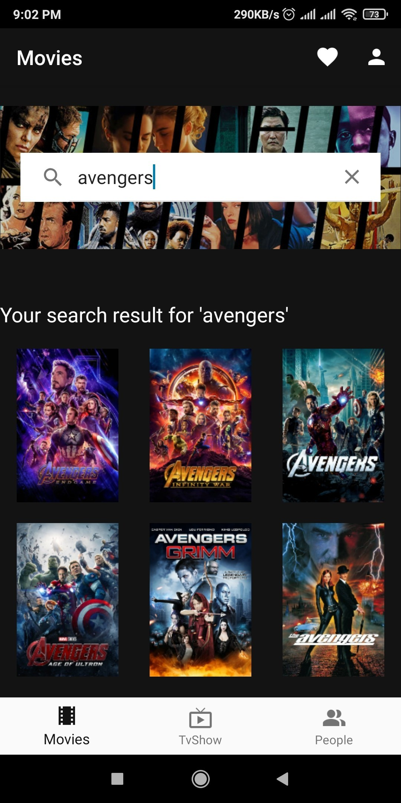
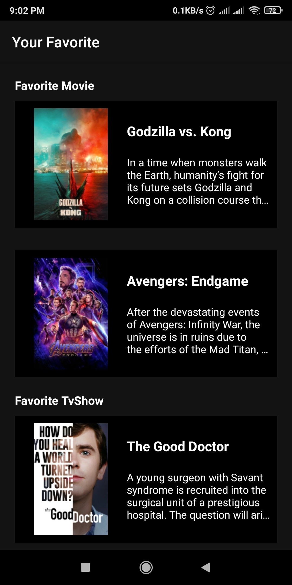
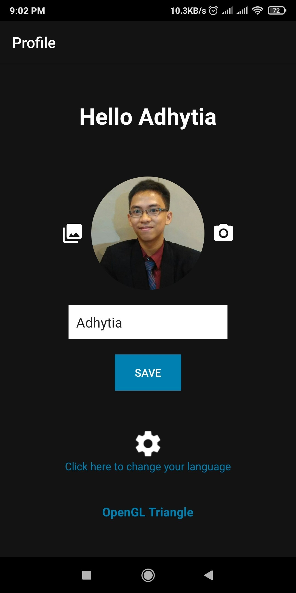

# Carifi
Carifi adalah aplikasi berbasis mobile yang membantu pengguna dalam mencari berbagai informasi mengenai dunia perfilman.  

#### Unduh aplikasi Carifi <a href="https://play.google.com/store/apps/details?id=id.ac.ui.cs.mobileprogramming.adhytia.carifi" ><b>disini</b></a>

## Author
Muhamad Adhytia Wana Putra Rahmadhan  
1806141321  
Mobile Programming - A  

## Fitur Aplikasi
* **Search**
	* Melakukan pencarian informasi terkait movie, tv show, ataupun tokoh terkenal dalam dunia perfilman.
* **Favorit**
	* Menyimpan daftar movie, tv show, ataupun orang yang kamu sukai.
* **Profil**
	* Halaman profil untuk mengatur foto profil beserta nama.
* **Multi language**
	* Menyediakan dua pilihan bahasa yaitu bahasa indonesia dan bahasa inggris.

## Screenshots

